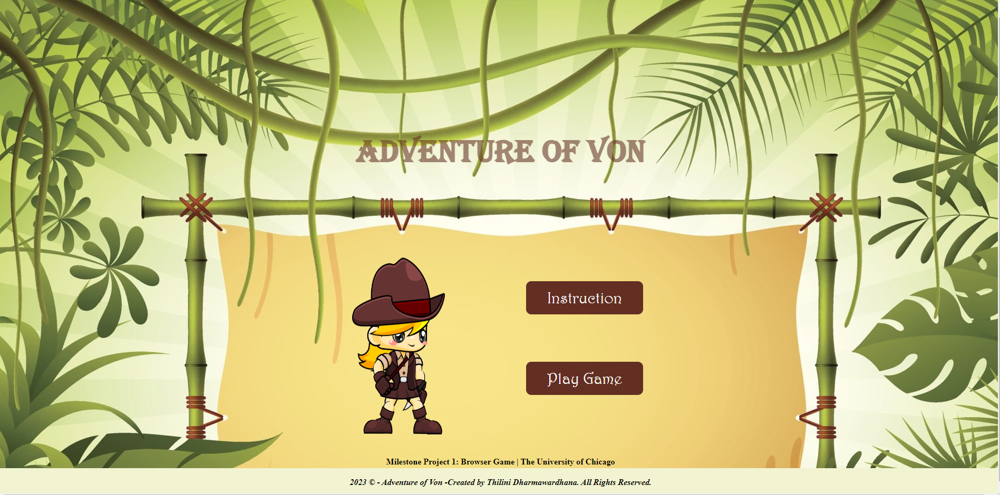
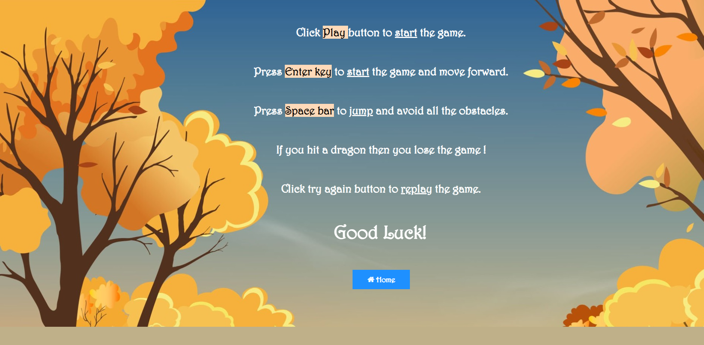
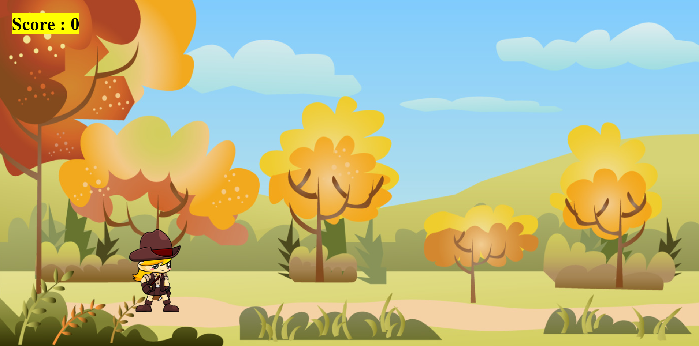
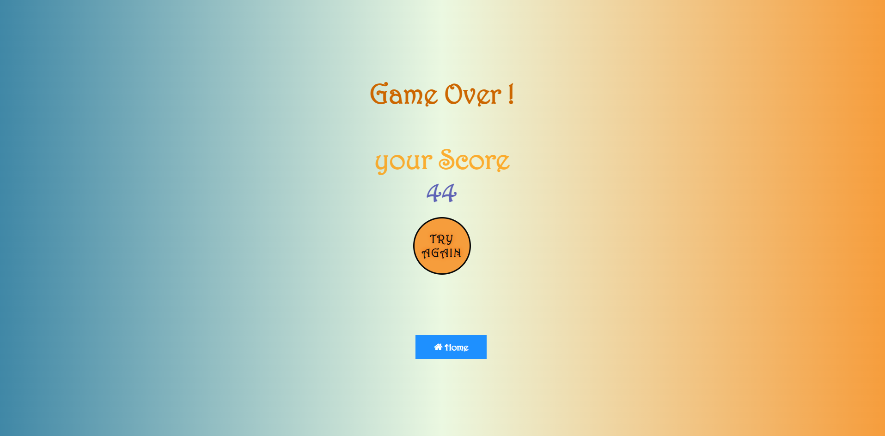
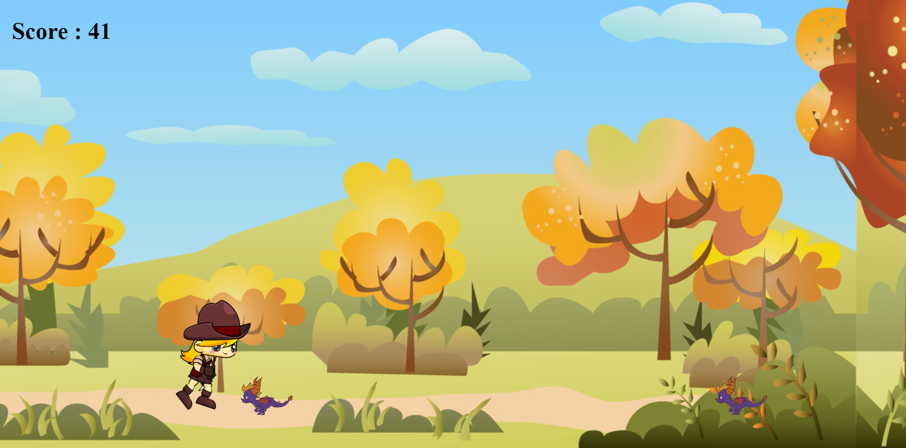
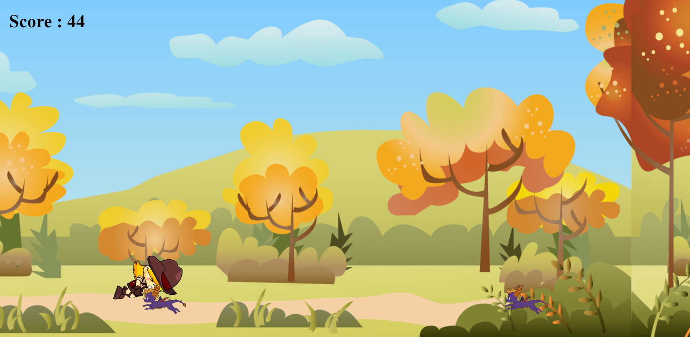
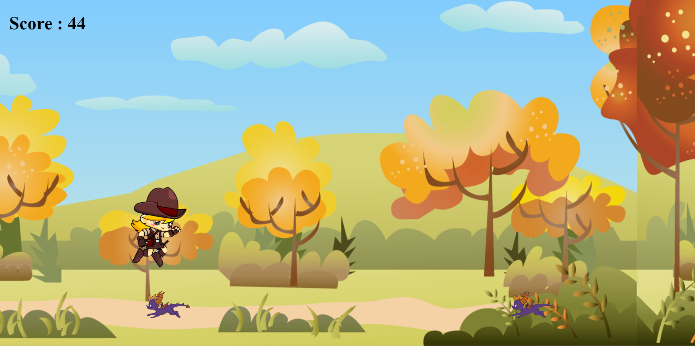

#### Milestone Project 1: Browser Game | Software development bootcamp | The University of Chicago
#### 2023 © - Adventure of Von -Created by Thilini Dharmawardhana. All Rights Reserved.

# Adventure of Von -2D browser game

A Adventure girl running 2D browser game where the objective is to move forward then jump and avoiding obstacles to achieve a higher score. Once you hit the obstacle then you will lose the game.

•The game has 3 pages,
  1. Index.html 
  2. Introduction.html
  3. start.html

## Screenshots:

## How to play: 

1.	Open the following URL:[title]https://thilinidharma.github.io/Milestone_Project_01/
2.  Click **Instruction** button to get instructions
3.  Click **Play** button to start the game
4.	Press **Enter** key to start the game and move forward.
5.  Press **space** to jump and avoid all the obstacles.
6.  If you hit a dragon then you lose the game.
7.  Click **Try again** button to replay the game.
8.  Click **Home** button to go back to home page.

## Deployment:

### Those steps were taking in order to deploy my page from GitHub repository:
1.	On Github navigate to[title]https://github.com/ThiliniDharma/Milestone_Project_01
2.	From the menu at the top click on settings
3.	Scroll down to the GitHub pages section
4.	Under Source section click on dropdown menu and select Main Branch as your GitHub pages publishing source.
5.	Select save.

### To create a local repository please follow those steps:
1.	Go to Github Project Repository
2.	Under the repository name click Clone or download
3.	In the 'Clone with HTTPs section' clone URL for the repository.
4.	Open Git Bash in your local platform.
5.	Change the current working directory to the location where you want the cloned directory to be made.
6.	Type git clone, and then paste the URL copied earlier: git clone[title]https://github.com/ThiliniDharma/Milestone_Project_01.git
7.	After pressing ENTER your local clone will be created.

## Technologies Used:

- **HTML** styling language used to format and visually build upon the accompanying HTML.
- **JavaScript** scripting language used to develop web pages and allows developers to create a dynamic and interactive experience for the user.
- **Github**  Used to host the deployed repository of all previous versions of the build.
- **Visual Studio Code**   is a code editor redefined and optimized for building and debugging modern web and cloud applications.

## Difficulties:

•	The challenges were many, but after lots of studying and with the knowledge acquired in the bootcamp, I managed to develop a simple and objective game. I had a lot of support and help from my instructors (thanks a lot **Megha Zavar** and **John Margotti**) to get it done.

## Links
- Game Art 2D-- free 2D game sprites[title]https://www.gameart2d.com/freebies.html
- Background images[title]https://www.vecteezy.com/
- Sound Bible-- Free sound effects[title]https://soundbible.com/
- FreeSFX --Free sound effects and music[title]https://freesfx.co.uk/
- Free Sound Effects --section of site with free sound effects[title]https://www.freesoundeffects.com/
- SoundsCrate-- Free music and sound effects[title]https://sfx.productioncrate.com/
- Bensound-- Free music[title]https://www.bensound.com/

